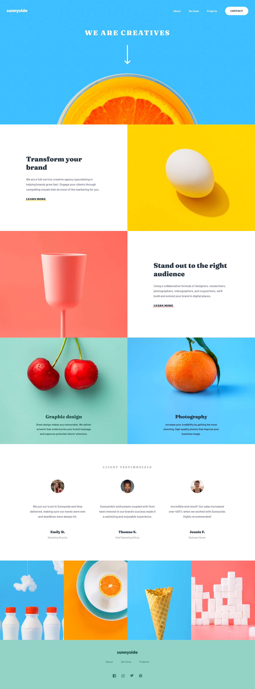
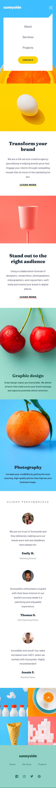

# Sunnyside Agnecy Landing Page

This is a solution to the [Sunnyside agency landing page challenge on Frontend Mentor](https://www.frontendmentor.io/challenges/sunnyside-agency-landing-page-7yVs3B6ef).

### Built with

- [React](https://reactjs.org/) - JS library
- TypeScript
- SCSS Modules

### Screenshots

### To Run Code

Please download the code and then run

`npm install`

followed by

`npm start`

and going to
http://localhost:3000
